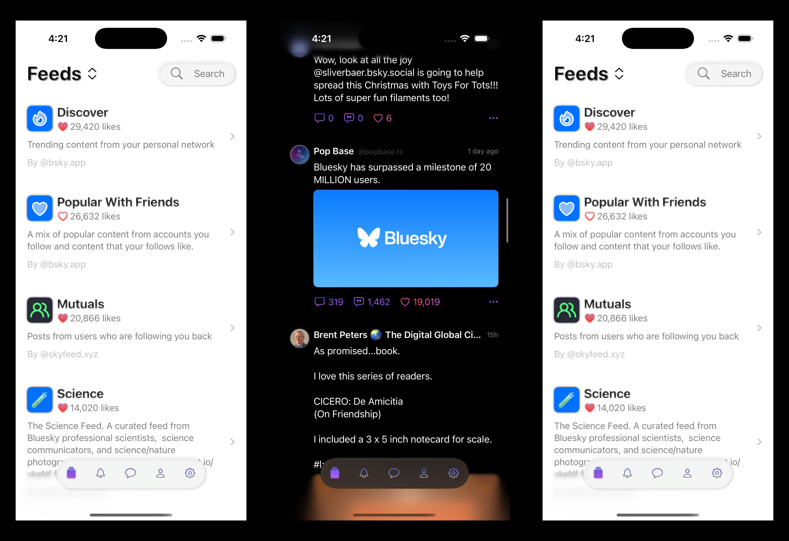
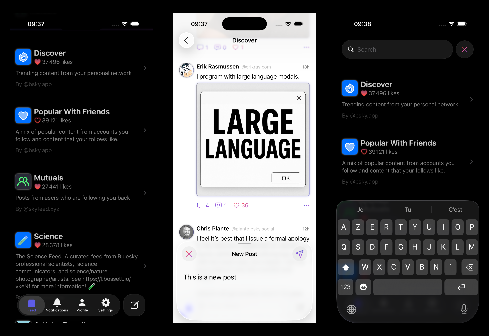

# IcySky 🧊✨

[](https://tuist.dev/Dimillian/IcySky/previews/latest)

A modern, beautiful Bluesky client for iOS built with SwiftUI and the latest iOS 26 SDK features.

## 🌟 About

IcySky (formerly known as GlowSky, RetroSky) is a native iOS client for [Bluesky](https://bsky.social), the decentralized social network built on the AT Protocol. This project showcases modern iOS development practices with a focus on beautiful, fluid UI powered by the latest SwiftUI capabilities.

### ✨ Features

- **Liquid Glass UI**: Leverages iOS 26's new Liquid Glass effects for a stunning, modern interface
- **Native Performance**: Built entirely in SwiftUI for smooth, responsive interactions
- **Modular Architecture**: Clean separation between UI and business logic using Swift Package Manager
- **AT Protocol Integration**: Full support for Bluesky's decentralized social features
- **Secure Authentication**: Login with app passwords, stored securely in iOS Keychain

### 🚧 Current Status

This is an early-stage project focused on establishing a solid foundation and exploring innovative UI designs. Currently implemented:

- ✅ Secure authentication with app passwords
- ✅ Feed browsing and exploration
- ✅ Beautiful, custom-designed UI components
- ✅ Modular package architecture
- 🏗️ Post composition (in progress)
- 🏗️ Profile viewing (in progress)
- 🏗️ Notifications (in progress)

## 📱 Screenshots




## 🛠️ Technical Details

### Requirements

- **iOS 26.0+** 
- **Xcode 26.0+** with iOS 26 SDK
- **Swift 6.2+**

### Architecture

IcySky follows a modular architecture with two main Swift packages:

- **Features Package**: All UI components and views
  - AuthUI, FeedUI, PostUI, ProfileUI, etc.
  - Custom DesignSystem with reusable components
  
- **Model Package**: Core business logic and data
  - Network layer (AT Protocol client)
  - Data models and state management
  - Authentication and user management

### Key Technologies

- **SwiftUI** with iOS 26's Liquid Glass effects
- **Swift Observation** framework for state management
- **AT Protocol** via ATProtoKit
- **Async/Await** for modern concurrency
- **KeychainSwift** for secure credential storage

## 🚀 Getting Started

1. Clone the repository:
   ```bash
   git clone https://github.com/Dimillian/IcySky.git
   ```

2. Open in Xcode:
   ```bash
   cd IcySky
   open IcySky.xcodeproj
   ```

3. Build and run on an iOS 26 simulator or device

### Development

The project uses a no-ViewModel approach, embracing SwiftUI's native patterns:
- Views as pure state expressions
- Environment-based dependency injection
- Local state management with enums
- Service classes for business logic

For detailed development guidelines, see [CLAUDE.md](CLAUDE.md).

## 🤝 Contributing

While this is currently a personal exploration project, feedback and ideas are welcome! Feel free to:
- Open issues for bugs or feature requests
- Share UI/UX suggestions
- Discuss architectural improvements

## 📄 License

This project is licensed under the MIT License - see the [LICENSE](LICENSE) file for details.

## 🙏 Acknowledgments

- Built with [ATProtoKit](https://github.com/MasterJ93/ATProtoKit) for AT Protocol support
- Inspired by the Bluesky community and the vision of decentralized social networking

---

*IcySky is an independent project and is not affiliated with Bluesky PBLLC.*
